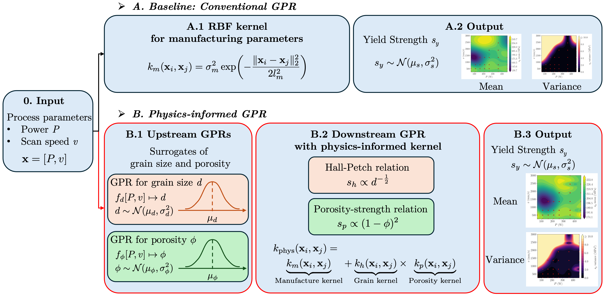

# Physics-Informed Gaussian Processes for LPBF Yield-Strength Prediction

This repository implements a hierarchical Gaussian process workflow for LPBF yield-strength prediction. The default experiment uses grouped cross-validation over the original process conditions and compares 11 process-only, microstructure-only, and physics-informed model variants.



## Workflow

The pipeline uses laser power `P` and scan speed `v` as process inputs. Upstream Gaussian processes predict grain size `d`, porosity `phi`, and their uncertainty from `[P, v]`. Downstream models then predict yield strength with either process-only kernels, direct microstructure baselines, deterministic physics features, or uncertainty-aware physics-informed kernels.

The default configuration is:

- repeated group holdouts: `5`
- held-out groups per repeat: `6`
- optimizer restarts for tuned models: `5`
- heteroscedastic target alpha: off
- target: yield strength from `data/AlSi10Mg PSP feature table.xlsx`

## Data

The datasets are sourced from Luo et al.:

- [ScienceDirect: S2214860422003128](https://www.sciencedirect.com/science/article/pii/S2214860422003128)
- [ScienceDirect: S2214860423004177](https://www.sciencedirect.com/science/article/abs/pii/S2214860423004177)

The current runnable workflow uses the AlSi10Mg spreadsheet. It reads 32 valid process conditions, extracts laser power, scan speed, grain-size statistics, porosity statistics, and yield-strength statistics, then evaluates models using group-level train/test splits by original process condition.

## Compared Models

The 11 evaluated models are:

1. `untuned_physics_informed`
2. `untuned_process_only`
3. `untuned_physics_mean_only`
4. `untuned_d_phi_only`
5. `untuned_physics_better_upstream`
6. `untuned_physics_p_only`
7. `untuned_physics_h_only`
8. `tuned_physics_informed`
9. `tuned_process_only`
10. `tuned_physics_mean_only`
11. `tuned_d_phi_only`

## Results

Primary comparison, averaged over the default grouped CV repeats:

| Set | Process-only baseline MAE / RMSE / CRPS | Physics-informed MAE / RMSE / CRPS |
|---|---:|---:|
| Train | 2.54 / 3.82 / 2.36 | 2.38 / 3.74 / 2.07 |
| Test | 15.13 / 17.79 / 14.55 | 8.37 / 11.04 / 7.86 |

Full 11-model test ranking:

| Model | MAE | RMSE | CRPS |
|---|---:|---:|---:|
| `tuned_process_only` | 5.42 | 7.81 | 4.43 |
| `tuned_physics_informed` | 5.45 | 7.80 | 4.41 |
| `tuned_d_phi_only` | 6.11 | 8.96 | 5.37 |
| `tuned_physics_mean_only` | 6.43 | 8.01 | 4.69 |
| `untuned_physics_better_upstream` | 7.67 | 10.61 | 7.04 |
| `untuned_physics_p_only` | 8.17 | 10.85 | 7.68 |
| `untuned_physics_informed` | 8.37 | 11.04 | 7.86 |
| `untuned_physics_mean_only` | 9.13 | 11.90 | 8.48 |
| `untuned_d_phi_only` | 9.14 | 11.99 | 8.50 |
| `untuned_physics_h_only` | 9.40 | 11.65 | 8.74 |
| `untuned_process_only` | 15.13 | 17.79 | 14.55 |

## Usage

Install the scientific Python dependencies:

```bash
pip install -r requirements.txt
```

Run the full 11-model grouped-CV workflow:

```bash
python main.py
```

Run the selected-repeat inverse optimization visualization:

```bash
python run_optimization.py
```

The optimization script saves selected-repeat visualization figures:

```text
outputs/selected_model/pv_mean_variance.png
outputs/selected_model/inverse_optimization_convergence.png
```

## Repository Layout

```text
data/                         AlSi10Mg source spreadsheet
                              Ti-6Al-4V source spreadsheet
method.png                    workflow figure
main.py                       full 11-model CV entry point
run_optimization.py           selected-repeat optimization figure entry point
src/data_prep.py              spreadsheet loading
src/model_runner.py           11-model GP workflow
src/optimization.py           selected-repeat inverse optimization figure
src/pipeline.py               public Python API
src/utils.py                  reproducibility and output helpers
```

